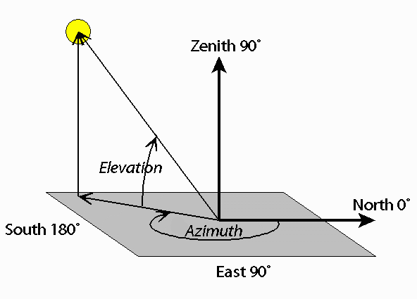

# Satellite Tracker 🛰️

A Python application for tracking and visualizing satellite positions over Earth. Using Two-Line Element (TLE) data from [Celestrak](https://celestrak.com/), this tool provides **2D ground track** and **polar coordinate visualizations** of selected satellites relative to chosen observer locations.

## Project Objectives 📌

- Retrieve and parse live TLE data from Celestrak for accurate satellite positioning.
- Generate **2D ground track** visualization of a satellite's path over Earth.
- Create **polar coordinate plots** showing satellite azimuth and elevation relative to the observer.
- Offer a command-line interface to select satellites, observer locations, and time zones.

## Conceptual Knowledge 📚

- **Ground Track**: The projection of a satellite's orbit onto a 2D map of Earth, tracing its path as seen from the surface.


- **Azimuth & Elevation**: Parameters describing satellite position relative to an observer:
  - *Azimuth*: Horizontal direction from the observer’s viewpoint (degrees).
  - *Elevation*: Vertical angle above the horizon (degrees).


- **Polar Visualization**: A plot using azimuth and elevation to represent a satellite’s visibility relative to an observer’s location.


## Features ✨

1. **Ground Track Visualization**  
   Tracks and plots the satellite’s projected orbit path over Earth in real time.

2. **Polar Coordinate Visualization**  
   Displays satellite passes in polar coordinates (azimuth and elevation) for a chosen observer location.

3. **Command-Line Application**  
   Customize your view by selecting satellites, observer locations, and time zones directly through the CLI.

## Installation ⚙️

Ensure Python 3.8+ and install dependencies:
```bash
pip install -r requirements.txt
```

## Usage 🛠️

Launch the program:

`python main.py`

Follow the command prompts to:

- Choose visualization type (Ground Track or Polar).
- Select a satellite from a predefined list.
- Pick an observer location and time zone.

The program then generates the requested visualization, providing a detailed view of the satellite’s position relative to Earth.

## Code Overview 🧩

`visualizations/ground_track.py`: Contains functions to generate 2D ground track visualizations.

`visualizations/polar_cord.py`: Generates polar plots to illustrate satellite passes.

`main.py`: Command-line interface for visualization selection and customization.

## Example Output 📸

- Ground Track Visualization
  ```bash
  Selected: Ground Track Visualization -> CREW DRAGON 9 -> US/Eastern -> Toronto`
  ```
  
  

- Polar Coordinate Visualization
  ```bash
  Selected: Polar Coordinate Visualization -> ISS (ZARYA) -> US/Eastern -> Hong Kong
  ```
  

## Libraries Used 📦

Skyfield: For satellite position calculations.
NumPy: Data handling and calculations.
Matplotlib: Plotting and visualizing satellite paths.

## Future Improvements 🚀

- Add support for more visualization options, including 3D tracking.
- Add visualizations that project onto the map of world
- Allow real-time updates of satellite passes.
